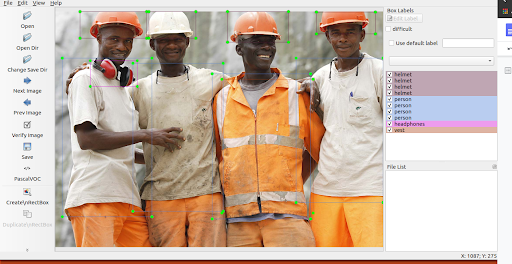

# Personal Protection Equipment Detection based on Deep Learning

Real time Personal Protection Equipment(PPE) detection running on NVIDIA Jetson TX2 and Ubuntu 16.04

  - Person, HardHat and Vest detection
  - Input from Video file or USB Camera
  - A backend service which can push message to "console" or "Cisco® Webex Teams space" when an abnormal event is detected.



# Requirements
  - NVIDIA Jetson TX2 or Ubuntu 16.04
  - NVIDIA GPU on Ubuntu 16.04 is optional
  - Python3

# How to run

## Video Inference Service

```sh
$ cd inference
$ pip3 install -r requirements.txt
$ python3 video_demo.py --model_dir=xxx  --video_file_name=xxx --show_video_window=xxx --camera_id=xxx
```
* model_dir: the path to model directory
* video_file_name: input video file name or usb camera device name, you can get camera device name on ubuntu or NVIDIA Jeston by running
```sh
$ ls /dev/video* 
```
* show_video_window: the flag to show video window, the options are {0, 1}
* camera_id: It is just convenient for humans to distinguish between different cameras, and you can assign any value, such as camera001

## Backend Service
run the following command
```
$ cd backend
$ pip3 install -r requirements.txt
$ python3 main.py
```

run application as docker
```
docker-compose up
or
docker-compose up --build
```

send notification

By default, it will use the console notification, this just print the notification to stdout.
If you want to use Cisco® Webex Teams, use change the config referring to `config.py`.
Or you can write your own if you write your provider inheriting the `notification.Provider`

setup Cisco® Webex Teams

* create a robot referring to https://developer.cisco.com/webex-teams/, you will get the token
* create a webex-teams room and add the robot to that team
* go to https://developer.webex.com/docs/api/v1/rooms/list-rooms to get the new created room id
* put the above info to the `config.py`

Alert Message Format


* total_person: number of people detected
* without_hardhat: number of people without hard hat
* without_vest: number of people without Vest
* without_both: number of people without hard hat and vest

# Training Program
Based on TensorFlow Object Detection API, using pretrained ssd_mobilenet_v1 on COCO dataset to initialize weights.

# Training Data
coming soon!

# Reference work
* TensorFlow Object Detection: https://github.com/tensorflow/models/tree/master/research/object_detection

#Annotations 
* Labellmg imaging tool
